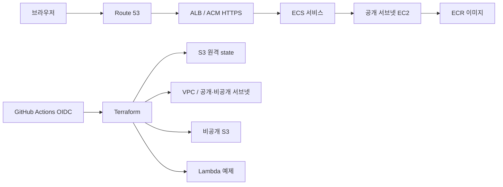
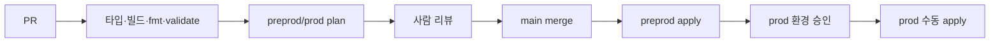

# 아키텍처

> 목표 아키텍처다. 이번 초기 커밋에는 앱과 CI만 포함되며 AWS 리소스와 Terraform 코드는 후속 PR에서 구현한다.

## 선택 이유

- **pnpm workspaces:** 앱과 향후 공유 패키지의 의존성을 하나의 lockfile로 관리한다. Turbo는 필요할 때 작업 그래프와 캐시만 추가하면 된다.
- **ECS on EC2:** EC2, 컨테이너 스케줄링, ECR을 함께 학습한다. 인스턴스 한 대라 가용 영역 장애를 견디지 못한다.
- **ALB + ACM + Route 53:** DNS, 인증서 검증, HTTP→HTTPS 전환과 헬스 체크를 실습한다.
- **NAT 없는 VPC:** 비용을 줄이기 위해 ECS 인스턴스는 공개 서브넷에서 실행하되 보안 그룹은 ALB에서 오는 동적 호스트 포트만 허용한다. SSH는 열지 않는다. 비공개 서브넷에는 현재 리소스를 놓지 않는다.
- **Lambda:** 별도의 `ping` 예제로 서버리스 배포를 연습한다. 공개 엔드포인트는 없다.
- **S3:** 앱 자산용 비공개 버킷과 Terraform state 버킷을 분리한다.

## 환경과 데이터 경계

계획상 `preprod`와 `prod`는 같은 Terraform 구성에 별도 `environment` 값을 넣는다. 서로 다른 VPC·ECR·ECS·ALB·S3·Lambda 이름과 `preprod/terraform.tfstate`, `prod/terraform.tfstate` 키를 가진다. 한 AWS 계정을 공유하면 IAM과 계정 수준 장애는 분리되지 않는다.

## 배포 흐름

구현 시 첫 배포에서는 ECR을 먼저 생성하고 이미지를 push한 뒤 ECS 서비스를 시작한다. 서비스는 bridge 네트워크의 동적 호스트 포트를 사용한다. ALB 대상 그룹은 instance 유형이고 EC2 보안 그룹은 ALB 보안 그룹에서 오는 임시 포트만 연다.

## 보안과 한계

구현 시 S3 버킷의 공개 접근을 막고 암호화·버전 관리를 사용한다. EC2 메타데이터는 IMDSv2로 제한한다. OIDC 역할은 GitHub repository subject와 환경 이름으로 신뢰 범위를 제한한다. plan 역할은 읽기와 state lock에 필요한 권한, apply 역할은 필요한 리소스 변경 권한만 부여하도록 설계한다. GitHub 환경 승인과 branch protection을 배포 통제에 포함한다.
