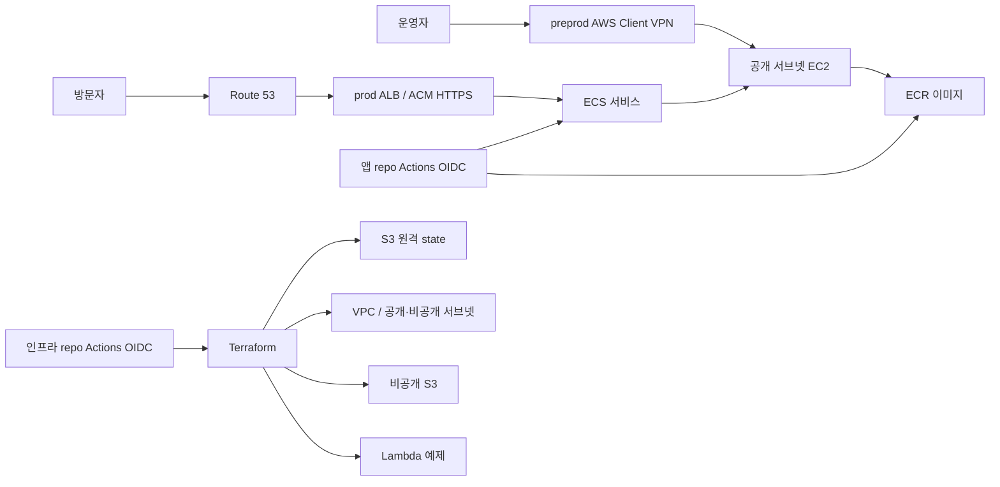
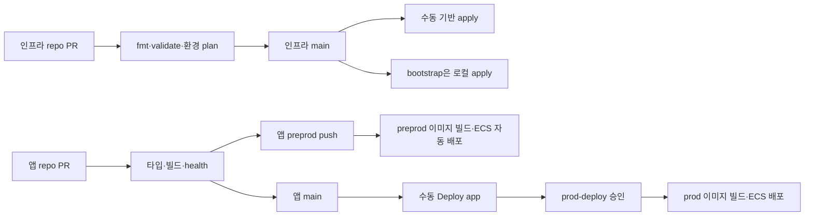

# 아키텍처

> 아래 구조는 목표 아키텍처다. 실제로 적용된 범위는 [README](../README.md#적용-상태-확인)를 본다. 이 문서는 잘 바뀌지 않는 구조만 다루고, 세부 설정과 그 이유는 링크한 코드의 주석이 기준이다.

## 선택 이유

- **앱 저장소의 pnpm workspaces:** 앱과 향후 공유 패키지의 의존성을 하나의 lockfile로 관리한다. Turbo는 필요할 때 앱 저장소에 추가한다.
- **ECS on EC2:** EC2, 컨테이너 스케줄링, ECR을 함께 학습한다. preprod는 호스트 한 대만 두므로 가용 영역 장애를 견디지 못한다.
- **prod ALB + ACM + Route 53:** DNS, 인증서 검증, HTTP→HTTPS 전환과 헬스 체크를 실습한다. 부모 도메인 `bandal.dev`는 Vercel에 그대로 두고 `aws.bandal.dev`만 Route 53에 위임한다. preprod는 VPN 안에서 HTTP로만 접속하므로 웹용 ALB와 HTTPS 인증서를 쓰지 않는다.
- **NAT 없는 VPC:** 두 환경의 CIDR과 공개·비공개 서브넷을 분리한다. 공개 서브넷도 자동 퍼블릭 IP 할당을 끈다. preprod 호스트는 ECR·SSM 접근을 위해 퍼블릭 IP 한 개를 명시적으로 받는다. 앱 HTTP와 SSH는 인터넷에 열지 않는다. 비공개 서브넷에는 현재 리소스를 놓지 않는다.
- **Lambda:** 별도의 `ping` 예제로 서버리스 배포를 연습한다. 공개 엔드포인트는 없다.
- **S3:** 앱 자산용 비공개 버킷과 Terraform state 버킷을 분리한다.

## 환경과 데이터 경계

`preprod`와 `prod`는 AI 성능 실험과 학습을 위한 환경이다. 같은 모듈을 쓰되 루트는 `infra/environments/preprod`, `infra/environments/prod`로 나눈다. 두 환경은 값뿐 아니라 구성이 달라지므로, 각 루트의 `main.tf`가 그 환경의 구성을 그대로 보여 주게 하기 위해서다. VPC CIDR은 각각 `10.60.0.0/16`, `10.61.0.0/16`이고 리소스 이름과 `preprod/terraform.tfstate`, `prod/terraform.tfstate` 키를 분리한다.

- **preprod:** 고가용성이 필요 없다. ALB 없이 ECS 호스트 한 대를 두고, AWS Client VPN의 인증서로 접속한 기기만 호스트의 사설 IP와 HTTP 3000 포트에 접근한다. 관리형 VPN 엔드포인트는 연결자가 없어도 시간당 과금된다. 호스트에는 공개 수신 규칙이 없다.
- **prod:** 두 AZ에 호스트를 한 대씩 두고 ALB와 ACM 인증서로 `aws.bandal.dev` 공개 HTTPS를 제공한다. ALB는 두 AZ의 공개 서브넷을 쓴다. 호스트는 공개 IP로 ECR·SSM에 나가지만 인터넷에서 직접 들어오는 포트는 없다.

두 환경은 한 AWS 계정을 공유하므로 IAM과 계정 수준 장애는 분리되지 않는다. 계정을 나누려면 AWS Organizations가 필요한데, 현재 Free plan 계정이 가입하면 크레딧이 즉시 만료되고 유료 플랜으로 전환된다. 실제 사용자 데이터를 다루거나 Free plan이 끝나거나 환경 간 IAM 격리가 필요해지면 계정 분리를 다시 검토한다. 콘솔은 계정 하나에서 리소스 이름과 `Environment` 태그로 환경을 구분한다.

## 배포 흐름

두 저장소는 [인프라](https://github.com/ban-dal/aws-ecs-fullstack-app)와 [앱](https://github.com/ban-dal/aws-ecs-fullstack-web)으로 나뉜다. 앱 workflow는 환경별 commit SHA 이미지를 별도 ECR에 올리고 ECS의 활성 task definition revision을 갱신한다. Terraform의 `image_tag`는 신규 서비스 생성 시의 seed이며 이후 앱 배포 버전은 앱 workflow가 관리한다. preprod는 Client VPN에서 호스트 사설 IP의 고정 앱 포트로만 들어오고, prod는 bridge 네트워크의 동적 호스트 포트를 쓴다. prod ALB 대상 그룹은 instance 유형이고 prod EC2 보안 그룹은 ALB 보안 그룹에서 오는 임시 포트만 연다.

## 요청 경로 관측

prod 홈 화면과 `/api/backend`는 요청의 Host, `X-Forwarded-Proto`, `X-Amzn-Trace-Id` 헤더를 읽는다. 앱이 실행 중인 ECS 태스크 ID는 ECS task metadata v4에서, EC2 인스턴스 ID와 가용 영역은 IMDSv2에서 읽는다. 메타데이터 조회는 prod에서만 하고, 계정 ID가 포함된 태스크 ARN과 자격 증명은 응답에 포함하지 않는다. 별도 AWS 읽기 권한은 필요하지 않다.

`/api/backend`를 반복 호출해 나타난 서로 다른 호스트 수는 그 요청의 표본이다. ALB 전체 대상의 정상 상태나 ECS 서비스 전체 태스크 수를 의미하지 않는다. 운영 상태는 [prod 점검 절차](operations.md#prod-공개-https-앱)로 확인한다.

## 보안과 한계

권한 정책이 무엇을 허용하고 거부해야 하는지는 [`infra/bootstrap/tests/`](../infra/bootstrap/tests/iam.test.mjs)의 테스트가 기준이다. bootstrap을 적용할 때마다 `scripts/bootstrap.sh plan`이 이 테스트를 실행한다.

- **state 버킷** ([`s3-terraform-state`](../infra/modules/s3-terraform-state/main.tf)): 공개 접근 차단, HTTPS 강제, 암호화, 버전 관리.
- **GitHub OIDC 역할** ([`iam`](../infra/modules/iam/main.tf)): 각 저장소의 immutable subject를 사용한다. 인프라 plan은 `ReadOnlyAccess`, apply는 `PowerUserAccess`와 공통 ECS 역할로 제한한 `iam:PassRole`을 가진다. 앱 저장소의 preprod·prod 역할은 각 ECR 저장소·ECS 서비스에만 쓴다. prod 역할은 앱 저장소의 main 전용 승인 환경만 신뢰한다. plan 역할은 승인 없이 PR 브랜치 코드도 받으므로 쓰기 역할과 합치지 않는다.
- **환경 경계**: 두 환경의 Terraform 루트와 state key는 분리하지만 IAM 역할은 공유한다. apply 역할은 IAM과 bootstrap의 state 버킷·감사 trail을 뺀 계정의 모든 리소스를 변경할 수 있다. main 전용 `*-apply` 환경, prod 승인과 저장 plan 비교로 적용 작업을 통제하며, 이 방식은 환경 간 IAM 격리나 IAM 비용 상한을 제공하지 않는다.
- **ECS 역할** ([`iam`](../infra/modules/iam/main.tf)): 두 환경이 호스트 역할과 태스크 실행 역할을 공유한다. apply는 이 두 역할만 정해진 서비스에 넘길 수 있고, 태스크 실행 역할은 두 환경 저장소 pull과 로그 쓰기만 할 수 있다.
- **사람의 운영 역할** ([`iam`](../infra/modules/iam/main.tf)): MFA 세션만 신뢰하는 계정 관리자 역할이다. bootstrap 운영에 쓰고 일상 배포는 GitHub 역할을 쓴다.
- **GitHub 환경 승인** ([`scripts/check-github-settings.sh`](../scripts/check-github-settings.sh)): `prod-apply`에만 필수 승인을 두고, 1인 저장소라 자기 승인을 허용한다. 두 `*-apply` 환경은 `main`에서만 배포한다.
- **적용 workflow** ([`apply-foundation.yml`](../.github/workflows/apply-foundation.yml), [`scripts/tfplan.sh`](../scripts/tfplan.sh)): 승인한 plan과 같은 변경만 적용한다. prod 웹 태스크 정의의 컨테이너 변경은 새 revision을 먼저 만드는 교체로 허용하며, 다른 삭제·교체는 막는다. destroy 경로는 아직 없다.
