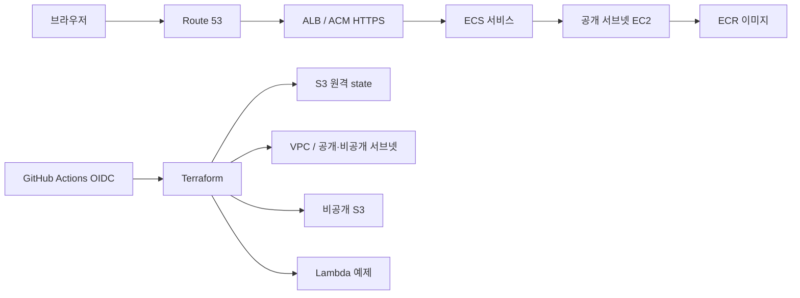
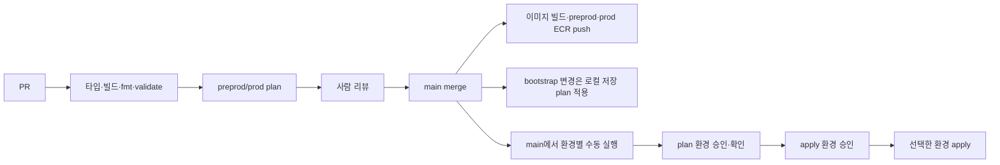

# 아키텍처

> 아래 구조는 목표 아키텍처다. 실제로 적용된 범위는 [README](../README.md#적용-상태-확인)를 본다. 이 문서는 잘 바뀌지 않는 구조만 다루고, 세부 설정과 그 이유는 링크한 코드의 주석이 기준이다.

## 선택 이유

- **pnpm workspaces:** 앱과 향후 공유 패키지의 의존성을 하나의 lockfile로 관리한다. Turbo는 필요할 때 작업 그래프와 캐시만 추가하면 된다.
- **ECS on EC2:** EC2, 컨테이너 스케줄링, ECR을 함께 학습한다. 인스턴스 한 대라 가용 영역 장애를 견디지 못한다.
- **ALB + ACM + Route 53:** DNS, 인증서 검증, HTTP→HTTPS 전환과 헬스 체크를 실습한다. 부모 도메인 `bandal.dev`는 Vercel에 그대로 두고 `aws.bandal.dev`만 Route 53에 위임한다. preprod는 VPN 안에서 HTTP로만 접속하므로 인증서는 prod ALB에만 쓴다.
- **NAT 없는 VPC:** 두 환경의 CIDR과 공개·비공개 서브넷을 분리한다. 공개 서브넷도 자동 퍼블릭 IP 할당을 끈다. 후속 ECS 인스턴스에 퍼블릭 IP가 필요하면 비용을 검토하고 명시적으로 할당한다. 호스트 보안 그룹은 ALB에서 오는 동적 호스트 포트만 허용하며 SSH는 열지 않는다. 비공개 서브넷에는 현재 리소스를 놓지 않는다.
- **Lambda:** 별도의 `ping` 예제로 서버리스 배포를 연습한다. 공개 엔드포인트는 없다.
- **S3:** 앱 자산용 비공개 버킷과 Terraform state 버킷을 분리한다.

## 환경과 데이터 경계

`preprod`와 `prod`는 AI 성능 실험과 학습을 위한 환경이다. 같은 모듈을 쓰되 루트는 `infra/environments/preprod`, `infra/environments/prod`로 나눈다. 두 환경은 값뿐 아니라 구성이 달라지므로, 각 루트의 `main.tf`가 그 환경의 구성을 그대로 보여 주게 하기 위해서다. VPC CIDR은 각각 `10.60.0.0/16`, `10.61.0.0/16`이고 리소스 이름과 `preprod/terraform.tfstate`, `prod/terraform.tfstate` 키를 분리한다.

- **preprod:** 고가용성이 필요 없다. ALB 없이 ECS 호스트 한 대를 두고, AWS Client VPN으로 접속한 사람만 호스트의 비공개 IP로 들어온다. VPN 터널이 암호화하므로 앱은 HTTP로 제공하고 인증서를 쓰지 않는다. Client VPN은 연결된 시간만큼 과금되므로 쓸 때만 서브넷에 연결한다.
- **prod:** 두 AZ에 호스트를 두고 ALB와 ACM 인증서로 공개 HTTPS를 제공한다. ALB는 서브넷이 두 AZ에 있어야 하므로 두 환경 모두 VPC 서브넷은 두 AZ에 둔다.

두 환경은 한 AWS 계정을 공유하므로 IAM과 계정 수준 장애는 분리되지 않는다. 계정을 나누려면 AWS Organizations가 필요한데, 현재 Free plan 계정이 가입하면 크레딧이 즉시 만료되고 유료 플랜으로 전환된다. 실제 사용자 데이터를 다루거나 Free plan이 끝나거나 환경 간 IAM 격리가 필요해지면 계정 분리를 다시 검토한다. 콘솔은 계정 하나에서 리소스 이름과 `Environment` 태그로 환경을 구분한다.

## 배포 흐름

이미지는 main에서 한 번 빌드해 두 환경 저장소에 같은 commit SHA 태그로 올린다. 배포는 이 태그를 고르므로 prod에는 preprod와 같은 커밋이 간다. 첫 배포에서는 이미지가 저장소에 있는 상태에서 ECS 서비스를 시작한다. 서비스는 bridge 네트워크의 동적 호스트 포트를 사용한다. ALB 대상 그룹은 instance 유형이고 EC2 보안 그룹은 ALB 보안 그룹에서 오는 임시 포트만 연다.

## 보안과 한계

권한 정책이 무엇을 허용하고 거부해야 하는지는 [`infra/bootstrap/tests/`](../infra/bootstrap/tests/iam.test.mjs)의 테스트가 기준이다. bootstrap을 적용할 때마다 `scripts/bootstrap.sh plan`이 이 테스트를 실행한다.

- **state 버킷** ([`s3-terraform-state`](../infra/modules/s3-terraform-state/main.tf)): 공개 접근 차단, HTTPS 강제, 암호화, 버전 관리.
- **GitHub OIDC 역할** ([`iam-github-plan`](../infra/modules/iam-github-plan/main.tf), [`iam-github-apply`](../infra/modules/iam-github-apply/main.tf)): 저장소 immutable subject와 GitHub 환경 이름으로 신뢰를 제한하고, 환경별 plan·apply 역할이 자기 환경만 다룬다.
- **permissions boundary** ([`iam-github-oidc`](../infra/modules/iam-github-oidc/main.tf)): 모든 GitHub 역할의 상한. IAM은 bootstrap이 만든 ECS 역할을 넘기는 권한만 있고, STS 권한은 얻지 못한다.
- **ECS 역할** ([`iam-ecs-roles`](../infra/modules/iam-ecs-roles/main.tf)): apply 역할은 자기 환경 호스트 역할을 EC2에, 태스크 실행 역할을 ECS 태스크에 넘기기만 한다. 태스크 실행 역할은 자기 환경 저장소 pull과 로그 쓰기만 할 수 있다. 운영 역할은 이 역할들을 고치지 못한다.
- **사람의 운영 역할** ([`iam-operator`](../infra/modules/iam-operator/main.tf)): MFA 세션만 신뢰한다. 프로젝트 인프라 전체를 바꿀 수 있으므로 일상 배포에는 쓰지 않는다.
- **GitHub 환경 승인** ([`scripts/check-github-settings.sh`](../scripts/check-github-settings.sh)): 1인 저장소라 자기 승인을 허용한다.
- **적용 workflow** ([`apply-foundation.yml`](../.github/workflows/apply-foundation.yml), [`scripts/tfplan.sh`](../scripts/tfplan.sh)): 승인한 plan과 같은 변경만 적용한다. 삭제·교체는 막으며, destroy 경로는 아직 없다.
