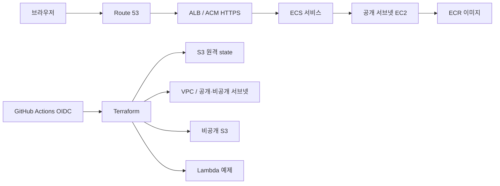

# 아키텍처

> 아래 앱 서비스 구조는 목표 아키텍처다. state 버킷·OIDC·비용 Budget과 `preprod` 서비스 기반, Task 006의 비루트 운영 IAM 사용자·역할은 AWS에 적용했다. Task 007에서 인증 앱 MFA로 비루트 CLI 역할 수임과 변경 없는 bootstrap plan을 검증했다.

## 선택 이유

- **pnpm workspaces:** 앱과 향후 공유 패키지의 의존성을 하나의 lockfile로 관리한다. Turbo는 필요할 때 작업 그래프와 캐시만 추가하면 된다.
- **ECS on EC2:** EC2, 컨테이너 스케줄링, ECR을 함께 학습한다. 인스턴스 한 대라 가용 영역 장애를 견디지 못한다.
- **ALB + ACM + Route 53:** DNS, 인증서 검증, HTTP→HTTPS 전환과 헬스 체크를 실습한다.
- **NAT 없는 VPC:** 두 환경의 CIDR과 공개·비공개 서브넷을 분리한다. 공개 서브넷도 자동 퍼블릭 IP 할당을 끈다. 후속 ECS 인스턴스에 퍼블릭 IP가 필요하면 비용을 검토하고 명시적으로 할당한다. 호스트 보안 그룹은 ALB에서 오는 동적 호스트 포트만 허용하며 SSH는 열지 않는다. 비공개 서브넷에는 현재 리소스를 놓지 않는다.
- **Lambda:** 별도의 `ping` 예제로 서버리스 배포를 연습한다. 공개 엔드포인트는 없다.
- **S3:** 앱 자산용 비공개 버킷과 Terraform state 버킷을 분리한다.

## 환경과 데이터 경계

`preprod`와 `prod`는 AI 성능 실험과 학습을 위한 환경이다. `infra/plan` 루트와 `infra/live` 모듈을 공유하되 별도 `environment` 값을 넣는다. VPC CIDR은 각각 `10.60.0.0/16`, `10.61.0.0/16`이고 ECR 및 네트워크 이름과 `preprod/terraform.tfstate`, `prod/terraform.tfstate` 키를 분리한다. 향후 ECS·ALB·S3·Lambda도 환경별 이름을 사용한다. 두 환경은 한 AWS 계정을 공유하므로 IAM과 계정 수준 장애는 분리되지 않는다. 계정 분리는 실제 운영 요건이 생길 때 다시 결정한다.

Task 005에서 `preprod` VPC·서브넷·라우팅·보안 그룹·비공개 ECR을 적용하고 사후 변경 없음 plan을 확인했다. `prod`는 같은 모듈을 plan만 했으며 아직 적용하지 않았다. 공개 앱과 실행 중인 컴퓨트 리소스는 없다.

## 배포 흐름

구현 시 첫 배포에서는 ECR을 먼저 생성하고 이미지를 push한 뒤 ECS 서비스를 시작한다. 서비스는 bridge 네트워크의 동적 호스트 포트를 사용한다. ALB 대상 그룹은 instance 유형이고 EC2 보안 그룹은 ALB 보안 그룹에서 오는 임시 포트만 연다.

## 보안과 한계

bootstrap 구성은 S3 공개 접근 차단, HTTPS 강제, SSE-S3 암호화, 버전 관리를 설정한다. Task 008부터 OIDC plan 역할은 환경별로 나뉘어 이 저장소의 immutable subject와 자기 `*-plan` 환경 이름만 신뢰하고, 자기 환경 state 읽기와 잠금 파일 권한만 가진다. 적용 역할은 선택한 환경의 state key, 환경별 ECR 저장소, `Environment` 태그가 같은 환경인 EC2 네트워크 리소스만 생성·변경·삭제한다. 모든 GitHub 역할에는 환경 state·서울 리전 EC2·ECR만 허용하는 permissions boundary가 연결되어 IAM·STS 권한을 얻지 못한다. ALB 보안 그룹의 공개 ingress는 닫혀 있다.

Task 006은 콘솔 비밀번호·MFA를 Terraform 밖에서 등록하는 사람의 IAM 사용자와 MFA 필수 bootstrap 운영 역할을 추가한다. 사용자는 운영 역할 수임 외에 직접 리소스 변경 권한을 갖지 않는다. 역할은 프로젝트 state 버킷과 bootstrap OIDC·GitHub 역할 관리에 한정하며 자기 역할 정책을 직접 수정하지 못한다. Budget은 읽기만 가능하다. GitHub 역할의 권한 정책과 신뢰 정책은 바꿀 수 있지만 boundary 정책은 읽기만 하고, boundary 제거·교체와 boundary 없는 역할 재생성은 거부된다. 따라서 GitHub 역할을 자신이 수임하도록 고쳐도 얻는 권한은 boundary 안의 프로젝트 state·EC2·ECR로 제한된다. 이 역할은 여전히 프로젝트 인프라 전체를 바꿀 수 있으므로 일상 배포 대신 bootstrap 관리에만 사용한다.
