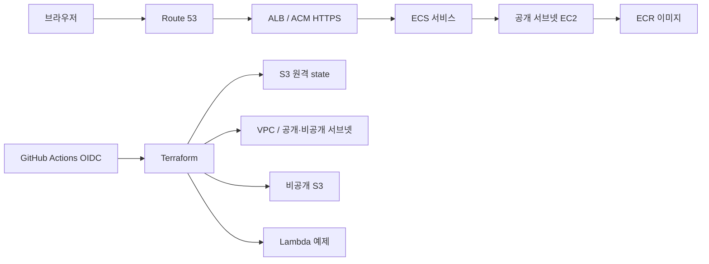
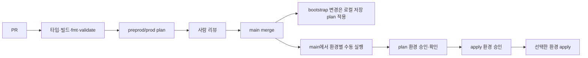

# 아키텍처

> 아래 구조는 목표 아키텍처다. 실제로 적용된 범위는 [README의 현재 상태](../README.md#현재-상태)를 본다. 주요 선택의 이유는 [결정 기록](decisions/README.md)에 있다.

## 선택 이유

- **pnpm workspaces:** 앱과 향후 공유 패키지의 의존성을 하나의 lockfile로 관리한다. Turbo는 필요할 때 작업 그래프와 캐시만 추가하면 된다.
- **ECS on EC2:** EC2, 컨테이너 스케줄링, ECR을 함께 학습한다. 인스턴스 한 대라 가용 영역 장애를 견디지 못한다.
- **ALB + ACM + Route 53:** DNS, 인증서 검증, HTTP→HTTPS 전환과 헬스 체크를 실습한다.
- **NAT 없는 VPC:** 두 환경의 CIDR과 공개·비공개 서브넷을 분리한다. 공개 서브넷도 자동 퍼블릭 IP 할당을 끈다. 후속 ECS 인스턴스에 퍼블릭 IP가 필요하면 비용을 검토하고 명시적으로 할당한다. 호스트 보안 그룹은 ALB에서 오는 동적 호스트 포트만 허용하며 SSH는 열지 않는다. 비공개 서브넷에는 현재 리소스를 놓지 않는다.
- **Lambda:** 별도의 `ping` 예제로 서버리스 배포를 연습한다. 공개 엔드포인트는 없다.
- **S3:** 앱 자산용 비공개 버킷과 Terraform state 버킷을 분리한다.

## 환경과 데이터 경계

`preprod`와 `prod`는 AI 성능 실험과 학습을 위한 환경이다. `infra/plan` 루트와 `infra/live` 모듈을 공유하되 별도 `environment` 값을 넣는다. VPC CIDR은 각각 `10.60.0.0/16`, `10.61.0.0/16`이고 ECR 및 네트워크 이름과 `preprod/terraform.tfstate`, `prod/terraform.tfstate` 키를 분리한다. 향후 ECS·ALB·S3·Lambda도 환경별 이름을 사용한다. 두 환경은 한 AWS 계정을 공유하므로 IAM과 계정 수준 장애는 분리되지 않는다([0001](decisions/0001-single-account-environments.md)).

## 배포 흐름

구현 시 첫 배포에서는 ECR을 먼저 생성하고 이미지를 push한 뒤 ECS 서비스를 시작한다. 서비스는 bridge 네트워크의 동적 호스트 포트를 사용한다. ALB 대상 그룹은 instance 유형이고 EC2 보안 그룹은 ALB 보안 그룹에서 오는 임시 포트만 연다.

## 보안과 한계

- **state 버킷:** 공개 접근 차단, HTTPS 강제, SSE-S3 암호화, 버전 관리, 이전 버전 만료. `force_destroy=false`.
- **GitHub OIDC 역할:** 저장소 immutable subject와 GitHub 환경 이름으로 신뢰를 제한한다([0002](decisions/0002-github-oidc-approvals.md)). plan 역할은 환경별로 나뉘어 자기 state 읽기와 잠금만 한다. apply 역할은 자기 state key, 자기 ECR 저장소, `Environment` 태그가 같은 EC2 네트워크 리소스만 생성·변경·삭제한다.
- **permissions boundary:** 모든 GitHub 역할의 상한은 환경 state와 서울 리전 EC2·ECR이다. IAM·STS 권한은 얻지 못한다([0005](decisions/0005-github-role-boundary.md)).
- **사람의 운영 역할:** MFA 세션만 신뢰하고 state 버킷, OIDC 제공자, GitHub 역할의 정책을 관리한다. boundary는 읽기만 하고 제거·교체하지 못한다. 자기 역할·사용자·Budget·boundary 변경은 root로 적용한다([0004](decisions/0004-human-operator-access.md)). 프로젝트 인프라 전체를 바꿀 수 있으므로 일상 배포에는 쓰지 않는다.
- **네트워크:** ALB 보안 그룹의 공개 ingress는 닫혀 있다. ECS 호스트 보안 그룹은 ALB에서 오는 동적 포트만 받고 SSH는 열지 않는다.
- **한계:** 두 환경은 IAM과 계정 한도를 공유한다. 현재 적용 workflow는 신규 생성만 허용하고, 승인 시점의 plan과 적용되는 plan이 같다는 보장이 없다([0003](decisions/0003-protected-apply.md)).
