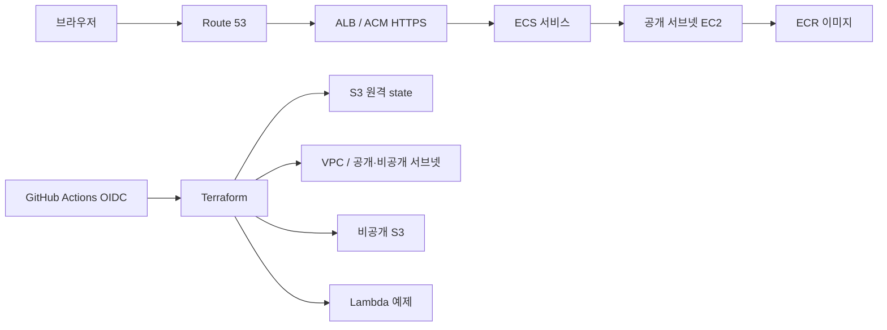

# 아키텍처

> 아래 앱 서비스 구조는 목표 아키텍처다. state 버킷·OIDC·비용 Budget의 bootstrap은 AWS에 적용했다. Task 003에서 VPC·서브넷·보안 그룹·ECR 코드를 준비했지만 서비스 리소스는 아직 적용하지 않았다.

## 선택 이유

- **pnpm workspaces:** 앱과 향후 공유 패키지의 의존성을 하나의 lockfile로 관리한다. Turbo는 필요할 때 작업 그래프와 캐시만 추가하면 된다.
- **ECS on EC2:** EC2, 컨테이너 스케줄링, ECR을 함께 학습한다. 인스턴스 한 대라 가용 영역 장애를 견디지 못한다.
- **ALB + ACM + Route 53:** DNS, 인증서 검증, HTTP→HTTPS 전환과 헬스 체크를 실습한다.
- **NAT 없는 VPC:** 두 환경의 CIDR과 공개·비공개 서브넷을 분리한다. 공개 서브넷도 자동 퍼블릭 IP 할당을 끈다. 후속 ECS 인스턴스에 퍼블릭 IP가 필요하면 비용을 검토하고 명시적으로 할당한다. 호스트 보안 그룹은 ALB에서 오는 동적 호스트 포트만 허용하며 SSH는 열지 않는다. 비공개 서브넷에는 현재 리소스를 놓지 않는다.
- **Lambda:** 별도의 `ping` 예제로 서버리스 배포를 연습한다. 공개 엔드포인트는 없다.
- **S3:** 앱 자산용 비공개 버킷과 Terraform state 버킷을 분리한다.

## 환경과 데이터 경계

`preprod`와 `prod`는 `infra/plan` 루트와 `infra/live` 모듈을 공유하되 별도 `environment` 값을 넣는다. VPC CIDR은 각각 `10.60.0.0/16`, `10.61.0.0/16`이고 ECR 및 네트워크 이름과 `preprod/terraform.tfstate`, `prod/terraform.tfstate` 키를 분리한다. 향후 ECS·ALB·S3·Lambda도 환경별 이름을 사용한다. 한 AWS 계정을 공유하면 IAM과 계정 수준 장애는 분리되지 않는다.

## 배포 흐름

구현 시 첫 배포에서는 ECR을 먼저 생성하고 이미지를 push한 뒤 ECS 서비스를 시작한다. 서비스는 bridge 네트워크의 동적 호스트 포트를 사용한다. ALB 대상 그룹은 instance 유형이고 EC2 보안 그룹은 ALB 보안 그룹에서 오는 임시 포트만 연다.

## 보안과 한계

bootstrap 구성은 S3 공개 접근 차단, HTTPS 강제, SSE-S3 암호화, 버전 관리를 설정한다. OIDC plan 역할은 이 저장소의 immutable subject와 `preprod-plan`·`prod-plan` 환경 이름만 신뢰한다. state 객체 읽기와 잠금 파일에 필요한 권한만 부여하고 state 객체 쓰기 권한은 주지 않는다. Task 003의 VPC·ECR 읽기 정책과 Task 004의 환경별 적용 역할은 아직 AWS에 반영되지 않았다. 적용 역할은 선택한 환경의 state key와 서울 리전의 기반 네트워크 작업, 환경별 ECR 저장소 작업만 허용한다. EC2 네트워크 API 일부는 생성 전 리소스 ID를 알 수 없어 서울 리전 전체를 대상으로 하므로 두 환경 간 완전한 권한 격리는 아니다. ALB 보안 그룹의 공개 ingress는 닫혀 있다.
